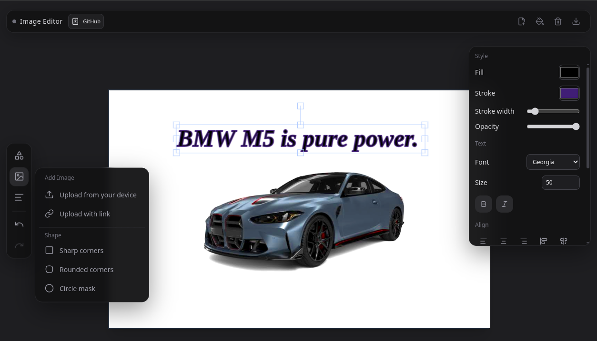

# Image Editor

A modern, responsive browser-based image editor built with **React**, **TypeScript**, and **Fabric.js**.

Upload images, add shapes & text, apply filters, and export as PNG — all in a clean, dark UI.

**Live Demo:** [https://image-editor-ivory-eta.vercel.app](https://image-editor-ivory-eta.vercel.app)

## Preview

<!-- Replace these with real screenshots or a GIF -->

